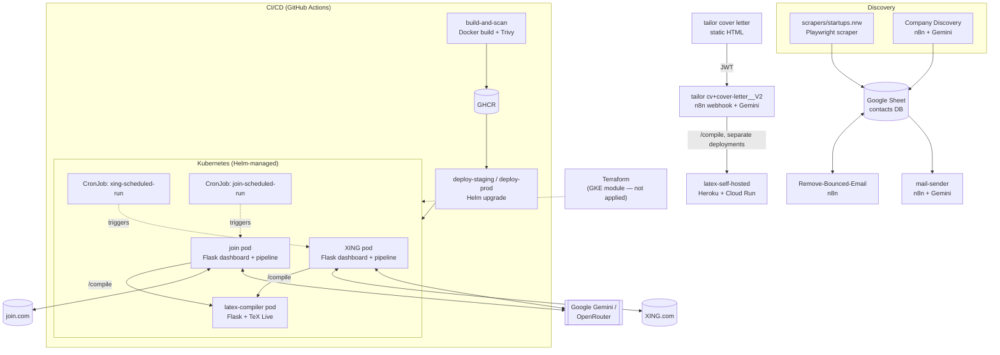

# Architecture

A full technical reference for the Job-Automation system: every technology in the stack, how the services are built, how they're containerized and deployed, and the security decisions behind each layer. For a lighter-weight tour, see [README.md](README.md); for exhaustive per-file detail on any one service, see its dedicated doc (linked throughout).

## 1. System overview

The project has two halves that share infrastructure but run independently:

1. **Job-application pipelines** (`XING/`, `join/`) — scrape job postings, filter them with an LLM, tailor a CV and cover letter per job, compile both to PDF, and submit the application through the site's own apply flow.
2. **Cold-outreach automation** (`Automated workflows/`, `scrapers/startups.nrw/`) — n8n workflows that discover companies and personal contact emails, keep that contact list clean by pruning bounces, and send templated outreach emails on a schedule.

A third, cross-cutting piece — the `latex-self-hosted` PDF compiler — is called by both halves and by an on-demand webhook (`tailor cover letter/`). Everything above the application layer (containers, Kubernetes, Terraform, CI/CD) exists to take the two Python pipelines and the compiler service from "scripts on one machine" to "something deployable and operable by more than one person."

## 2. Architecture diagram



## 3. Technology stack

| Layer | Technology | Where |
|---|---|---|
| Language / runtime | Python 3.11 | `XING/`, `join/`, `scrapers/` |
| Browser automation | Playwright (Chromium, Firefox) | harvesting, enrichment, applying, login |
| Web framework | Flask + Gunicorn | dashboards (`XING/`, `join/`), `latex-self-hosted/` |
| AI / LLM | Google Gemini (`gemini-2.5-flash`, `gemini-3-*`), OpenRouter (DeepSeek) | filtering, classification, tailoring, form-answering |
| Document generation | LaTeX (XeLaTeX / pdfLaTeX), TeX Live | CV and cover-letter compilation |
| Data storage (app) | Excel/CSV via pandas + openpyxl | per-pipeline job tracking (`output/*.xlsx`) |
| Data storage (outreach) | Google Sheets | shared contacts DB across three n8n workflows |
| Workflow automation | n8n (hosted) | cold-outreach and on-demand tailoring workflows |
| Containers | Docker, `mcr.microsoft.com/playwright/python` base image | all three deployable services |
| Orchestration | Kubernetes | Deployments, PVCs, CronJobs, Services, Ingress, NetworkPolicy |
| Packaging | Helm 3 | `deploy/helm/job-automation/` |
| Infrastructure as Code | Terraform (`hashicorp/google` provider) | `terraform/` — GKE Autopilot |
| CI/CD | GitHub Actions | `.github/workflows/ci-cd.yml` |
| Container registry | GHCR (`ghcr.io`) | image storage, cloud-agnostic |
| Security scanning | Trivy (`aquasecurity/trivy-action`) | CRITICAL-CVE gate on every image build |
| Search APIs (job discovery) | Google Custom Search, Perplexity, SerpAPI, Brave Search, ScrapingBee | `join/` only, pluggable |
| Google APIs | Sheets, Drive, Gmail (OAuth2) | n8n workflows |
| Web scraping proxy | Jina AI Reader (`r.jina.ai`) | on-demand tailoring webhook |

## 4. Application services

### 4.1 XING pipeline (`XING/`)

A five-stage, state-driven pipeline (`harvest → filter → enrich → classify → apply`), each stage reading/writing an Excel file so a crash mid-run loses no progress. AI filtering and classification use Gemini 2.5 Flash; CV/cover-letter tailoring uses the same model with prompts externalized to `config/prompts/`. A Flask dashboard (`src/dashboard.py`) exposes the job database, PDF previews, and buttons that trigger pipeline stages as subprocesses. Full detail: [xing.md](xing.md).

### 4.2 join.com pipeline (`join/`)

Same shape, adapted for join.com, which has no scrapable in-site search — job discovery instead queries external search engines (`site:join.com/companies ...`) through a pluggable set of providers. Filtering is two-pass (cheap URL-slug filter, then full-description deep filter). An `AIClient` abstraction (`src/ai_client.py`) lets every AI call target either Gemini or OpenRouter via `AI_PROVIDER`. Full detail: [join.md](join.md).

### 4.3 LaTeX compiler service (`latex-self-hosted/`)

A minimal Flask service: `POST /compile` takes LaTeX source, runs `xelatex` twice (the first pass resolves TikZ coordinates the second pass needs), and returns the PDF. This one service is used by *three* different callers — both Python pipelines (via `LATEX_COMPILER_URL`, in-cluster or local) and the n8n webhook workflow (via two separate hosted deployments, Heroku and Cloud Run). Same code, same API, multiple independent deployments. Full detail: [latex-self-hosted.md](latex-self-hosted.md).

### 4.4 n8n workflows (`Automated workflows/`)

Four exported workflows, all sharing one Google Sheet as a contacts database:

- **Company Discovery** — Gemini-driven B2B research, finds companies + verified personal (non-role-based) emails, deduped against the sheet.
- **Remove-Bounced-Email** — parses Gmail bounce notifications, cross-references against the sheet, marks bad rows.
- **mail-sender** — sends templated cold "Initiativbewerbung" emails from the sheet, rate-limited (jittered waits, daily cap).
- **tailor cv+cover-letter__V2** — the webhook backend for `tailor cover letter/index.html`: scrapes a job posting (via Jina AI), generates tailored CV + cover-letter LaTeX with Gemini, compiles both via `latex-self-hosted`, uploads to Google Drive, returns links.

Full detail: [automated-workflows.md](automated-workflows.md).

### 4.5 Scraper (`scrapers/startups.nrw/`)

A standalone Playwright scraper harvesting company/contact data from startups.nrw, feeding the `startups-nrw` tab that the outreach workflows read from. No AI involved. Full detail: [scrapers.md](scrapers.md).

### 4.6 On-demand tailoring UI (`tailor cover letter/`)

A single static HTML page — client-side JWT generation, calls the n8n webhook, renders the returned CV/cover-letter/Drive links. Full detail: [tailor-cover-letter.md](tailor-cover-letter.md), including a flagged hardening item (the JWT secret is hardcoded client-side).

## 5. AI integration

Every AI call in the Python pipelines goes through a small number of patterns, not ad hoc prompting:

- **Structured JSON output**: filtering and classification prompts force Gemini to return a strict JSON array/object (`{keep: bool, score: int, reason: str}` etc.) rather than free text — this is what makes batch filtering of dozens of jobs in one call reliable.
- **Two-pass cost control**: a free local regex pre-filter eliminates obvious mismatches before anything reaches the LLM; only borderline/plausible jobs get the expensive "deep" AI pass.
- **Externalized prompts**: every prompt lives in `config/prompts/*.txt`, not inline in Python — changing tailoring behavior doesn't require a code change.
- **Provider abstraction** (`join/` only): `src/ai_client.py` wraps both `google-generativeai` and OpenAI's SDK (pointed at OpenRouter) behind one interface, selected by `AI_PROVIDER` env var — the rest of the codebase doesn't know which provider it's talking to.
- **The "Smart Questions" agent**: ATS application forms ask unpredictable custom questions. The agent injects JavaScript to dump every unanswered form field (labels + options) from the live page, sends the whole batch to Gemini in one call alongside the candidate's CV/personal info, and fills the answers back in — with a JS "fuzzy match" fallback for dropdowns when the AI's answer doesn't exactly match an option string.
- **Constrained document generation**: CV/cover-letter tailoring prompts carry hard constraints (max 1 page, max N experience entries, no LaTeX packages known to break the compiler) precisely because an unconstrained LLM output reliably breaks `pdflatex`/`xelatex`.

## 6. Data & state management

Two separate, deliberately simple state stores, chosen for the same reason: resumability without infrastructure.

- **Per-pipeline job tracking**: Excel files under `output/` (`filtered_jobs.xlsx`, `final_jobs_auto.xlsx`, etc.), read/written by pandas. Each pipeline stage updates a `Status` column; a crash on job #40 means jobs #1–39 are safely recorded and a rerun resumes at #40. This is also why config edits made via the dashboard's UI don't currently survive a Kubernetes redeploy of `keywords.json`/prompts — see [§9.3](#93-known-limitations).
- **Cross-workflow contacts DB**: one Google Sheet, three n8n workflows reading/writing different tabs (`Feuille 7`, `startups-nrw`, `munich-startups`, `Scraped`) — a shared, human-inspectable spreadsheet rather than a real database, appropriate for the current outreach volume.

## 7. Containerization

Three Dockerfiles (`XING/`, `join/`, `latex-self-hosted/`), each with a matching `.dockerignore` excluding secrets/generated data from the build context.

- **Base images**: XING/join use `mcr.microsoft.com/playwright/python:v1.49.0-jammy` (ships Chromium/Firefox and all system deps pre-installed, version-pinned to match the `playwright` package in `requirements.txt` — a mismatch here breaks browser launches). `latex-self-hosted` uses `python:3.11.10-slim` plus TeX Live packages.
- **Headful browsers in a container**: every Playwright launch uses `headless=False` (tuned against XING/join's bot detection) rather than headless. Instead of changing that, each container runs a small `docker-entrypoint.sh` that starts `Xvfb` (a virtual X11 display), polls for its socket, then execs Gunicorn — verified end-to-end by actually launching Chromium against the virtual display inside the built image, not just assumed.
- **Non-root, matched UID**: XING/join reuse the base image's pre-existing `pwuser` (UID/GID 1000); `latex-self-hosted` creates its own `appuser` pinned to the same UID/GID. This isn't cosmetic — Kubernetes' `fsGroup: 1000` on mounted Secret volumes only grants read access to that GID, so a mismatched container UID would silently fail to read its own mounted secrets at runtime.
- **Health checks**: all three expose `/healthz`, used by both Docker's own `HEALTHCHECK` and Kubernetes' liveness/readiness probes — none existed before this work.
- **Prod-safe serving**: both dashboards previously ran Flask's dev server with `debug=True` (Werkzeug's debugger allows remote code execution if reachable); all three now run under Gunicorn with debug off.
- **Image hygiene**: `latex-self-hosted`'s `/compile` endpoint used to leave a `/tmp/<uuid>` work directory behind on every request — a disk-fill risk under sustained traffic — now cleaned up in a `finally` block. The Dockerfile also runs `apt-get upgrade` to pull current Debian security patches (added after CI's Trivy gate caught real CRITICAL CVEs in `libgnutls30`/`libssl3` from the base image).

## 8. Kubernetes deployment

Chart at [`deploy/helm/job-automation/`](../deploy/helm/job-automation/), parameterized via `values.yaml` + `values-staging.yaml`/`values-prod.yaml` overlays. Full operational detail (secrets bootstrap, local validation, moving to a real cluster): [deployment.md](deployment.md).

**Design decisions:**

- **One Deployment per app, not a CronJob-only model.** XING/join each run as a long-lived Deployment (1 replica — the Excel-file state model doesn't support horizontal scaling) whose Flask dashboard is both the UI and the trigger point for pipeline runs, exactly as it works locally. A lightweight `CronJob` per app just `curl`s that Deployment's own `/api/action/*` route on a schedule — no separate pipeline-only pod, and no need for `ReadWriteMany` storage since only the Deployment pod ever touches its PVC.
- **`latex-compiler` is a separate, stateless Deployment**, `ClusterIP`-only, restricted by a `NetworkPolicy` to accept traffic only from the two pipeline pods — it's never meant to be internet-reachable.
- **Config-as-code, not config-as-PVC.** `keywords.json`, `search_keywords.json`, and prompt templates are baked into the image (git is the audit trail); only `output/` (job database, generated PDFs) lives on a PVC. `session.json` (Playwright login state) and `personal_info.txt` (PII) are Kubernetes Secrets, mounted read-only. This is a deliberate tradeoff — see [§9.3](#93-known-limitations).
- **Ingress with basic auth.** Neither dashboard has its own authentication; exposing them past `localhost` without gating them at the Ingress layer (`nginx.ingress.kubernetes.io/auth-*`) would let anyone who finds the URL trigger pipeline runs, edit config, and read PII.
- **Pod security**: non-root (UID 1000, matched to the image — see §7), all Linux capabilities dropped, `automountServiceAccountToken: false` (none of these pods talk to the Kubernetes API).

## 9. Infrastructure as Code (Terraform)

`terraform/` provisions the **cluster only** — Helm deploys everything on top of it, and stays cloud-agnostic regardless of which cluster it's pointed at. Full detail: [terraform/README.md](../terraform/README.md).

- **`modules/gke/`** — a real, `terraform validate`/`plan`-tested GKE Autopilot module (Google manages nodes/scaling, a better fit here than a hand-sized node pool).
- **The module contract**: four outputs (`cluster_name`, `endpoint`, `ca_certificate`, `location`) that any future cloud module must match — adding AWS/Azure later means a new `modules/eks/` or `modules/aks/` with the same output shape, not a redesign. No untested multi-cloud code exists today; the contract is what keeps that addition cheap when it's actually needed.
- **Nothing has been applied.** No cluster exists yet; the project currently validates against local `minikube`.

### 9.1 CI/CD pipeline

[`.github/workflows/ci-cd.yml`](../.github/workflows/ci-cd.yml):

1. **`build-and-scan`** (matrix over the 3 services) — Docker build → **Trivy scan, gated on CRITICAL severity** (`exit-code: 1`, `ignore-unfixed: true` — a real fixable CVE fails the build; nothing fixable to a target doesn't) → push to GHCR, tagged by branch/tag context and by commit SHA.
2. **`check-secrets`** — resolves whether `KUBECONFIG_STAGING`/`KUBECONFIG_PROD` are actually set, exposed as job outputs. (GitHub Actions schema-rejects the `secrets` context directly inside a job-level `if:` — confirmed the hard way, then verified with `actionlint` before pushing the fix.)
3. **`deploy-staging`** / **`deploy-prod`** — `helm upgrade --install` against the target cluster; currently **skip cleanly** (not fail) since no cluster/secret exists yet, and will start running automatically the moment `KUBECONFIG_STAGING`/`KUBECONFIG_PROD` are added — no workflow change required. Prod additionally sits behind a GitHub **Environment** requiring manual approval.

### 9.2 Security posture

A running list of what's actually been hardened, not just planned:

- **Secrets never in git**: `.env`, `session.json`, `personal_info.txt` (real PII), and the Google OAuth client JSON are all `.gitignore`d; `.env.example`/`personal_info.txt.example` document the shape without real values. Verified explicitly (`git add -A -n` audited) before every commit in this project, catching a real near-miss where `personal_info.txt` would have been committed.
- **Image scanning**: every image build is gated on Trivy finding zero fixable CRITICAL CVEs — not advisory, the build fails.
- **No Docker-socket-in-container**: both pipelines used to shell out to `docker run` for PDF compilation, which would require mounting the host Docker socket into a Kubernetes pod (a container-escape-adjacent privilege-escalation pattern most cluster admission policies block anyway). Replaced with plain HTTP calls to the `latex-self-hosted` service.
- **Non-root, minimal-capability containers**: see §7 and §8.
- **Network segmentation**: `latex-compiler` is unreachable from anything except the two pipeline pods, enforced by `NetworkPolicy`, not just convention.
- **No prod debug servers**: Flask `debug=True` removed from both dashboards (remote-code-execution risk via Werkzeug's debugger if the port were ever reachable).
- **Ingress-layer auth** on dashboards that have none of their own.
- **Known, tracked, unfixed**: the `tailor cover letter/index.html` JWT-signing secret is hardcoded client-side and duplicated in the n8n workflow — flagged in [tailor-cover-letter.md](tailor-cover-letter.md), not yet remediated.

### 9.3 Known limitations

- **Dashboard config edits don't persist in-cluster.** A direct consequence of the config-as-code decision in §8 — editing `keywords.json`/prompts via the dashboard UI works locally but won't survive a pod restart in Kubernetes. The fix, if this workflow matters in production, is having the dashboard's settings-write endpoint patch a ConfigMap via the Kubernetes API instead of writing a local file — not built yet.
- **No cloud secrets manager.** Kubernetes Secrets are the baseline (base64, not encrypted unless the cluster has etcd encryption configured); an External Secrets Operator + cloud KMS is the natural next step once a cloud provider is actually in use.
- **Scrapers and the static tailoring page aren't containerized** — low-risk, low-frequency, deferred rather than forgotten.

## 10. Repository structure

```
Job-Automation/
├── XING/                       # XING.com pipeline + dashboard (containerized)
├── join/                       # join.com pipeline + dashboard (containerized)
├── latex-self-hosted/          # shared LaTeX→PDF compiler service (containerized)
├── scrapers/startups.nrw/      # contact-harvesting scraper (not containerized yet)
├── tailor cover letter/        # static on-demand tailoring UI
├── Automated workflows/        # n8n workflow exports (JSON)
├── deploy/helm/job-automation/ # Kubernetes Helm chart
├── terraform/                  # GKE cluster IaC (prep only, not applied)
├── .github/workflows/ci-cd.yml # build → scan → push → deploy pipeline
├── docs/                       # this documentation set
└── README.md                   # project entry point
```
