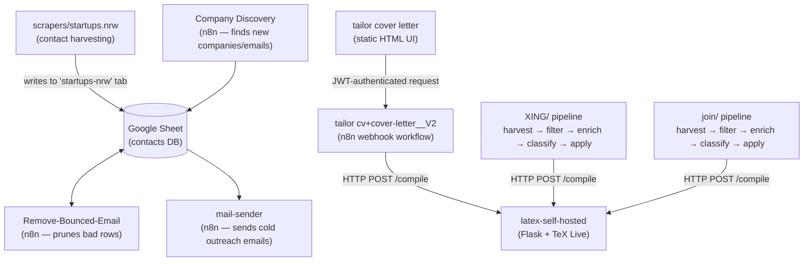

# Job-Automation — Documentation Index

This project is a personal job-search automation system with two halves:

1. **Job application pipelines** — scrape job boards, filter with AI, tailor a CV + cover letter per job, compile them to PDF, and auto-submit applications through the site's own apply flow.
2. **Cold-outreach pipelines** — discover companies/contacts, send personalized "Initiativbewerbung" (spontaneous application) emails, and keep the contact list clean by pruning bounces.

A shared LaTeX-compilation microservice and a webhook-triggered on-demand variant tie the pieces together.

## Modules

| Module                        | What it does                                                                                                                                               | Docs                                             |
| ----------------------------- | ---------------------------------------------------------------------------------------------------------------------------------------------------------- | ------------------------------------------------ |
| `XING/`                       | Full pipeline (harvest → filter → enrich → classify → apply) for job postings on XING.com, plus a Flask dashboard                                          | [xing.md](xing.md)                               |
| `join/`                       | Same pipeline concept, retargeted at join.com; jobs are discovered via search-engine queries instead of site search, and it supports multiple AI providers | [join.md](join.md)                               |
| `latex-self-hosted/`          | Self-hosted Flask microservice that compiles LaTeX → PDF (used by both the Python pipelines locally and by the n8n cloud workflow)                         | [latex-self-hosted.md](latex-self-hosted.md)     |
| `scrapers/startups.nrw/`      | One-off Playwright scraper that harvests NRW-region startup contact data, feeding the cold-outreach workflows                                              | [scrapers.md](scrapers.md)                       |
| `tailor cover letter/`        | Static HTML front-end for the on-demand "tailor CV + cover letter" n8n webhook                                                                             | [tailor-cover-letter.md](tailor-cover-letter.md) |
| `Automated workflows/`        | n8n workflow exports: company/contact discovery, bounce cleanup, cold-email sending, and the webhook-driven CV/cover-letter tailoring backend              | [automated-workflows.md](automated-workflows.md) |
| `deploy/helm/job-automation/` | Kubernetes deployment: containerized XING/join/latex-compiler, Helm chart, CI/CD                                                                           | [deployment.md](deployment.md)                   |
| `terraform/`                  | Cluster infrastructure (GKE, currently) — provisions the Kubernetes cluster the Helm chart deploys into; not applied yet                                   | [../terraform/README.md](../terraform/README.md) |

## How the pieces fit together

`latex-self-hosted` is the same Flask service in every case, but it isn't one single deployment: the n8n webhook workflow calls two separately-hosted copies (Heroku for the CV, Cloud Run for the cover letter — see [automated-workflows.md](automated-workflows.md)), while `XING/` and `join/` call a third copy running in-cluster (see [deployment.md](deployment.md)). All three are interchangeable — same code, same `/compile` API.

## Shared conventions across the Python pipelines (`XING/`, `join/`)

- **State-driven pipeline**: each stage reads/writes an Excel file (`output/*.xlsx`) so a crash mid-run doesn't lose progress — rerunning resumes from the last unprocessed row.
- **AI engine**: Google Gemini (`google-generativeai`) for filtering, classification, tailoring, and answering ATS custom questions. `join/` additionally supports OpenRouter as a fallback provider.
- **Document generation**: LaTeX `.tex` templates, compiled to PDF via the `latex-self-hosted` service over HTTP (`LATEX_COMPILER_URL`) — see [latex-self-hosted.md](latex-self-hosted.md). Run it locally via Docker for dev, or point at the in-cluster deployment described in [deployment.md](deployment.md).
- **Browser automation**: Playwright, using a saved login session (`config/session.json`) captured once via a manual `login.py` run.
- **Config**: centralized in `config/settings.py`, secrets in `config/.env`, AI prompts externalized as `.txt` files under `config/prompts/`.

## Known hardening item

`tailor cover letter/index.html` embeds its JWT-signing secret in plaintext client-side JavaScript (and the same secret is duplicated in the `tailor cv+cover-letter__V2.json` n8n workflow's verification node). Anyone who views the page source can read and reuse it. See [tailor-cover-letter.md](tailor-cover-letter.md) for details — flagged here for awareness, not yet remediated.
